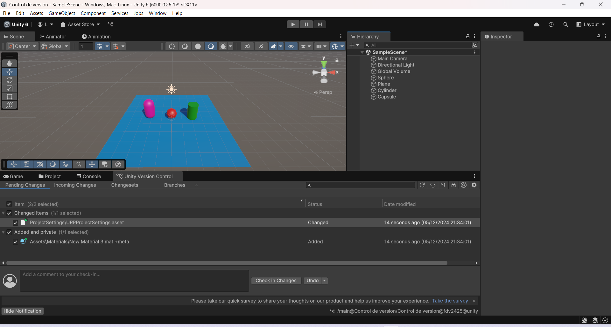
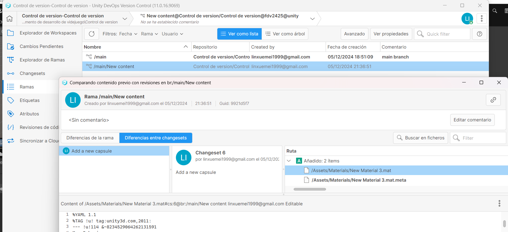

# FDV_1.4


```
>>  PRACTICA:   Unity Project 1.4 Control de version
>>  COMPONENTE: XueMei Lin
>>  GITHUB:     https://github.com/XueMei-L/FDV_UnityControlDeVersion.git
```

# Proceso de la practica 1.4
### 1. Crear un proyecto Unity 3D básico con control de versiones en Unity. 
He creado una nueva organizado para esta practica llamado: **FDV2425.**
Para crear un proyecto de unity en 3D con control de version, hay que activar la opcion de control de version para esta practica.

Se puede ver que en el panel de Unity Version Control hay ficheros iniciales, hacemos un commit para subir la primera version (crear un proyecto)


### 2. Realizar 2 cambios, agregando 2 objetos 3D, por ejemplo, una esfera y un plano. Añadirles material de color rojo y azul respecivamente. Grabar el proyecto.
Crea una esfera con material de color rojo y un plano con material de color azul.
Los cambios aparecen en el panel de **Unity Version Control.**

Guadamos los cambios ya tenemos una version nueva del proyecto.


### 3. Chequear los cambios en SCM
Instalar Plastic SCM, para ver los cambios guardados y las nuevas modificaciones:


### 4. Agregar un nuevo objeto, por ejemplo, un cilindro verde, guardar los cambios.
Crear un cilindro verde, y aparece los nuevos cambios.


En Plastic SCM tambien aparece los cambios.


### 5. Añadir una cápsula con una textura, agregar este cambio a una nueva rama.
Añadir una nueva cápsula con el color rosa.

Crear una subrama rama **[Create child branch]** para guardar este cambio y tambian hay que dar **[switch workspace to this branch]** para poder trbajar en la submara.

Subir los cambios. Podemos ver que los cambios estan en la subrama.
